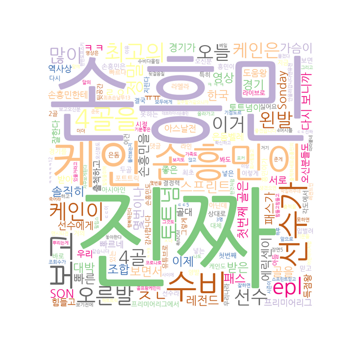

# 텍스트마이닝
- 원래의 저장소: [Project_Text](https://github.com/heonsooo/Project_Text)  
 
### 1) 유튜브 댓글 스크롤후 
- 1-1)시행착오(유튜브 댓글은 bs4 사용불가 : 유투브는 동적 사이트이기때문에 메인링크를 사용하는 bs4는 사용불가
- 1-2)  selenium 이용
+추가) youtube는 robots.txt에 의해 크롤링을 허락하지 않습니다! 주의하세요.

### 2) WordCloud 이용한 시각화

